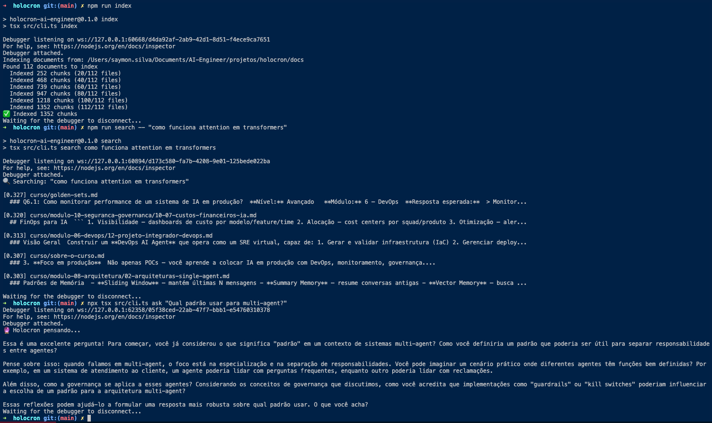

# 🔮 HOLOCRON AI ENGINEER

<p align="center">
  
</p>

> **🌟 Seu companheiro de estudos sempre disponível**
>
> Complemento inteligente para a pós de Engenharia de IA Aplicada — pergunte, pratique, simule e aprenda de forma natural durante as aulas.

[](https://www.typescriptlang.org/)
[](https://nodejs.org/)
[](https://www.postgresql.org/)
[](https://www.langchain.com/)

---

## 💡 O que é?

> *"Como os Holocrons Jedi armazenavam sabedoria ancestral, o Holocron AI Engineer cristaliza todo o conhecimento da pós para você acessar de forma natural, onde e quando precisar."*

**Holocron AI Engineer** é um **tutor inteligente integrado** que acompanha você durante todo a pós de Engenharia de IA Aplicada. Não é apenas documentação — é um **companheiro de estudos interativo** que:

- 💬 **Responde dúvidas** enquanto você assiste às aulas
- 🧪 **Simula cenários práticos** para você testar conceitos
- 🎯 **Sugere aplicações** dos conceitos em projetos reais
- 🔍 **Conecta conhecimentos** entre módulos diferentes
- 📊 **Acompanha seu progresso** e sugere próximos passos

## 🌟 Como funciona?

Todo o conteúdo da pós **Engenharia de IA Aplicada** (12 módulos, ~100 unidades) é cristalizado em uma **base de conhecimento viva** usando RAG.

### 🎓 Conhecimento validado por especialistas mundiais

O conteúdo do Holocron é baseado na pós ministrada por:

- **[Erick Wendel](docs/curso/professores.md#erick-wendel)** — Google Developer Expert, Microsoft MVP, membro do core team do Node.js
- **[Hugo Santos](docs/curso/professores.md#hugo-santos)** — Consultor internacional em IA
- **[Alvaro Camillo](docs/curso/professores.md#alvaro-camillo)** — Google Developer Expert, Senior Staff Engineer (Santander)
- **[Ahirton Lopes](docs/curso/professores.md#ahirton-lopes)** — 6× Microsoft MVP, 2× Google Developer Expert, membro do Google Advisory Board
- **[Camilla Martins](docs/curso/professores.md#camilla-martins)** — Google Developer Expert, 3× Docker Captain, HashiCorp Ambassador
- **[Jéssica Costa](docs/curso/professores.md#jéssica-costa)** — Google Developer Expert em IA, Doutoranda em Engenharia Biomédica

**5 Google Developer Experts** + **6× Microsoft MVP** + **Node.js Core Team** = conhecimento de **quem está no topo da carreira mundial**.

Você acessa esse conhecimento de forma natural:

## 🎯 O que ele faz

- **Domina** 100% do conteúdo da pós (12 módulos, ~100 unidades atomizadas)
- **Conhece você** — progresso, dificuldades, projetos aplicados (armazenado no Postgres)
- **Ensina de forma socrática** — questiona, faz pensar, propõe soluções
- **Valida** — dá feedback em código, sugere otimizações, aponta gaps
- **Evolui** — a base é realimentada com novas fontes continuamente baseadas nos conteudos da pós (versioning via Git)

### 🚀 Como você acessa o Holocron

Holocron está **onde você precisa dele** — escolha seu canal preferido:

---

#### 🔌 **1. MCP Server — Integração nativa na IDE**

> *"O conhecimento aparece quando você precisa, onde você precisa"*

Conecte o Holocron MCP Server ao **Claude Code, Cursor, Kiro, Windsurf** ou qualquer IDE com suporte MCP. O tutor aparece como um contexto nativo na sua IDE.

```json
// settings.json (Claude Code, Cursor, etc.)
{
  "mcpServers": {
    "holocron": {
      "command": "node",
      "args": ["dist/mcp/server.js"],
      "env": { "HOLOCRON_DB_URL": "postgresql://..." }
    }
  }
}
```

**💡 Exemplo:** Enquanto codifica um agente LangGraph, pergunta *"Como implemento memória de longo prazo?"* e o Holocron busca nos docs do módulo 4 + exemplos práticos aplicados.

---

#### 💻 **2. CLI — Comandos rápidos no terminal**

> *"Aprenda sem sair do fluxo de desenvolvimento"*

```bash
# Pergunta rápida
holocron ask "Qual padrão usar para multi-agent?"

# Review de código
holocron review src/agents/tutor.ts

# Quiz adaptativo
holocron quiz modulo-04-agentes

# Check do progresso
holocron status
```



---

#### 🌐 **3. Interface Web — Chat interativo com LibreChat**

> *"Sessões de estudo imersivas, simulações e acompanhamento visual"*

Uma interface conversacional web (powered by **LibreChat**) onde você pode:

- 💬 **Chat com o Tutor** — sessões de estudo socráticas
- 🗂️ **Explorar projetos** — navegar exemplos e conceitos aplicados do curso
- 📝 **Simular provas** — modo notebook-style para testar conhecimento (inspirado no NotebookLM)
- 📊 **Dashboard de progresso** — visualize scores, gaps de conhecimento, próximas unidades

**🛠️ Tech stack:** LibreChat (frontend) + Holocron backend (RAG + Agentes)

*** TODO - A ser construido**

---

#### 🤖 **4. Agente Conversacional — Especialista no curso**

> *"Pergunte sobre qualquer conceito, projeto ou decisão arquitetural"*

Um agente especializado que responde sobre:

- 📚 **Conceitos do curso** — RAG sobre toda a base de conhecimento (`docs/`)
- 🛠️ **Projetos práticos** — estrutura, dependências, como rodar, patterns aplicados
- 🏗️ **Código e arquitetura** — padrões usados, trade-offs, decisões via ADRs

**🎯 Diferencial:** Futuramente com modelo **fine-tuned** no conteúdo do curso (módulo 9) para respostas ainda mais precisas e contextualizadas.

---

## 🎯 Mapa de Competências — O que você vai dominar

O Holocron acompanha seu progresso em **4 dimensões de competências**:

| Dimensão | O que você desenvolve |
| -------- | --------------------- |
| 🧠 **Técnica** | Domínio de ferramentas, frameworks, algoritmos (LangChain, LangGraph, RAG, MCPs) |
| 🏗️ **Arquitetural** | Projetar sistemas escaláveis, tomar decisões de design, criar ADRs |
| 🚀 **Operacional** | Deploy em produção, CI/CD, monitoramento, troubleshooting |
| 🧑‍💼 **Comportamental** | Comunicação, gestão de projetos, trabalho em equipe, apresentações técnicas |

### 📊 Competências consolidadas por módulo

Ao final do curso, você será capaz de:

- ✅ **Integrar múltiplos provedores de LLMs** com fallback e caching (Módulo 2)
- ✅ **Criar MCP servers** para expor contexto empresarial em IDEs (Módulo 3)
- ✅ **Implementar agentes ReAct** com memória de longo prazo (Módulo 4)
- ✅ **Projetar pipelines RAG** escaláveis com vector databases (Módulo 8)
- ✅ **Fazer fine-tuning** de LLMs para domínios específicos (Módulo 9)
- ✅ **Implementar guardrails** e prevenir prompt injection (Módulo 10)
- ✅ **Colocar sistemas de IA em produção** com DevOps completo (Módulo 6)

👉 Veja o [Mapa de Competências completo](docs/curso/mapa-competencias.md) com objetivos detalhados por módulo.

---

### 🎓 Para todos os níveis de experiência

O Holocron se adapta ao seu perfil:

| Nível | O que você ganha |
| ----- | ---------------- |
| 🌱 **Iniciante** | Respostas passo a passo • Exemplos práticos detalhados • Validação de conceitos básicos |
| 🚀 **Intermediário** | Sugestões de otimização • Comparação de abordagens • Desafios incrementais |
| ⚡ **Avançado** | Arquitetura e trade-offs • Revisão profunda de código • Referências a papers acadêmicos |

---

## 🔮 Visão: Fine-tuning + Simulação Inteligente

À medida que mais alunos usam o Holocron, ele evolui. A visão futura inclui:

```text
┌─────────────────────────────────────────────────────┐
│  🧠 MODELO FINE-TUNED                              │
│  ────────────────────────────────────────────────  │
│  Treinado com conteúdo do curso + interações      │
│  reais dos alunos                                  │
└─────────────────────────────────────────────────────┘
```

### 🎯 Capacidades futuras

- 🎙️ **Simulação de provas** estilo NotebookLM — conversas de revisão, debates socráticos sobre conceitos
- 📊 **Quizzes adaptativos** — gerados dinamicamente baseados nos gaps detectados no seu perfil
- 🔮 **Previsão de dificuldades** — antecipa onde você pode travar antes mesmo de acontecer
- 🤝 **Sessões de pair programming** — o tutor codifica junto com você, explicando decisões

---

## 💭 Filosofia: Aprender fazendo

> *"Cada commit é um capítulo. Cada módulo do curso vira uma feature implementada. O projeto **é** o aprendizado."*

O Holocron não é apenas um projeto de estudo — ele é construído **aplicando** os conceitos de cada módulo do curso:

| 📚 Módulo do Curso | 🛠️ Aplicação no Projeto |
| ----------------- | ---------------------- |
| 🧠 Fundamentos de IA | TensorFlow.js para quiz adaptativo |
| 🔌 APIs & Prompt Eng | Multi-provider, prompt templates |
| 🌐 MCP | Holocron MCP Server |
| 🤖 Agentes | Agente Tutor (ReAct, memória, multi-agent) |
| 🎨 UX/UI | Interface web conversacional |
| 🚀 DevOps | CI/CD, IaC, observabilidade |
| 📋 Gestão de Projetos | Backlog automatizado, status reports |
| 🏗️ Arquitetura | Design AI-First, RAG patterns |
| 🎯 Fine-tuning | Modelo customizado para o domínio |
| 🔒 Segurança | Guardrails, rate limiting, governança |
| 🎓 Capstone | O próprio Holocron |
| 💼 Carreira | Portfolio piece |

---

## 🧪 Garantia de Qualidade — Golden-Sets

Para garantir que o Holocron ensina corretamente, usamos **golden-sets**: conjuntos de perguntas-chave com respostas esperadas para cada módulo.

### Como funcionam os golden-sets?

```text
Pergunta → Resposta do Holocron → Comparação com Golden-Set → Score de Qualidade
```

**Exemplo de golden-set:**

| Pergunta | Módulo | Pontos-chave esperados |
| -------- | ------ | ---------------------- |
| "O que é um embedding?" | 1 — Fundamentos | Representação vetorial densa • Captura semântica • Proximidade = similaridade |
| "Quando usar MCP vs Tools?" | 3 — MCP | MCP = contexto (read-only) • Tools = ação (side-effects) • Podem coexistir |
| "Como implementar memória de longo prazo?" | 4 — Agentes | Vector store (semântica) • SQL (estruturada) • Híbrida (melhor abordagem) |

### Benefícios

- ✅ **Validação automática** — testes de qualidade do RAG
- ✅ **Calibração de dificuldade** — ajuste de quizzes baseado em performance
- ✅ **Avaliação de alunos** — comparação de respostas com padrões esperados
- ✅ **Melhoria contínua** — identifica gaps na base de conhecimento

👉 Veja todos os [Golden-Sets](docs/curso/golden-sets.md) com respostas detalhadas.

---

## 📁 Estrutura do Projeto

```text
holocron/
├── 📚 docs/                     # Knowledge Base (Obsidian-compatible)
│   ├── curso/                  # Conteúdo atomizado por módulo
│   ├── conceitos/              # Conceitos transversais
│   ├── ferramentas/            # Stack e ferramentas
│   ├── projetos/               # Projetos práticos
│   ├── fontes/                 # Rastreabilidade de fontes
│   └── adrs/                   # Architecture Decision Records
├── 💻 src/                      # Código-fonte
│   ├── mcp/                    # MCP Server
│   ├── agents/                 # Agentes (Tutor, Quiz, etc.)
│   ├── rag/                    # Pipeline RAG
│   ├── api/                    # Backend API (Fastify)
│   └── db/                     # Schemas e migrations (Postgres)
├── 🎯 steerings/                # Instruções para agentes de IA (genérico)
├── .kiro/                      # Config específica Kiro
├── .cursor/                    # Config específica Cursor
└── .antigravity/               # Config específica Antigravity
```

---

## 🏗️ Decisões Arquiteturais

| Decisão | Justificativa |
| ------- | ------------- |
| 🗄️ **Dados do aluno em Postgres** | Progresso, scores, interações → banco relacional. Markdown só para conhecimento. ([ADR-001](docs/adrs/001-dados-aluno-postgres.md)) |
| 📝 **Knowledge Base em Markdown** | Conteúdo atômico, versionado via Git, compatível com Obsidian |
| 🔌 **Portável e plugável** | Engine genérico, KB substituível — funciona para qualquer curso |

---

## 🛠️ Stack Tecnológica

| Camada | Tecnologia |
| ------ | ---------- |
| 📚 **Knowledge Base** | Markdown + Obsidian + Git |
| 🔍 **Vector DB** | PostgreSQL + pgvector |
| 🧠 **RAG** | LangChain/LangGraph (TypeScript) |
| 🔌 **MCP Server** | TypeScript (@modelcontextprotocol/sdk) |
| 🤖 **Agentes** | LangGraph + multi-agent patterns |
| ⚡ **Backend** | Node.js + Fastify |
| 🎨 **Frontend** | React/Next.js + LibreChat |
| 🧪 **ML** | TensorFlow.js |
| 📊 **Observabilidade** | LangFuse |
| 🗄️ **Database** | PostgreSQL 16+ |

---

## 🚀 Começando

```bash
# 1️⃣ Clone o repositório
git clone https://github.com/seu-usuario/holocron.git
cd holocron

# 2️⃣ Instale as dependências
npm install

# 3️⃣ Configure o ambiente
cp .env.example .env
# Edite .env com suas credenciais (Postgres, OpenAI API, etc.)

# 4️⃣ Rode as migrations do banco
npm run db:migrate

# 5️⃣ Inicie o servidor de desenvolvimento
npm run dev

# 🔌 Ou inicie apenas o MCP Server
npm run mcp
```

### 📖 Próximos passos

1. **Conecte à sua IDE** — Configure o MCP Server no seu editor favorito
2. **Explore a base** — Abra `docs/` no Obsidian para navegar visualmente
3. **Faça uma pergunta** — Use o CLI: `holocron ask "O que é RAG?"`
4. **Acompanhe o progresso** — `holocron status`

---

## 🎯 Steerings para IDEs Agênticas

Os arquivos em `steerings/` são instruções compartilhadas que qualquer IDE agêntica pode consumir (Claude Code, Cursor, Kiro, etc.). Veja [steerings/README.md](steerings/README.md) para detalhes sobre como elas funcionam.

---

## 🤝 Contribuindo

Este projeto é aberto para contribuições! Algumas formas de ajudar:

- 📝 **Melhore a base de conhecimento** — adicione novos conceitos, atualize exemplos
- 🐛 **Reporte bugs** — encontrou algo quebrado? Abra uma issue
- ✨ **Sugira features** — ideias para melhorar o tutor são bem-vindas
- 📚 **Compartilhe casos de uso** — como você está usando o Holocron?

---

## 📚 Links Úteis

- 📖 **[Documentação Completa](docs/)** — conteúdo atomizado do curso
- 🏗️ **[ADRs](docs/adrs/)** — decisões arquiteturais documentadas
- 🎯 **[Steerings](steerings/)** — instruções para IDEs agênticas
- 🔌 **[MCP Protocol](https://modelcontextprotocol.io/)** — saiba mais sobre o Model Context Protocol

---

## 📄 Licença

MIT © 2026 Holocron AI Engineer

---

<p align="center">
  <i>Que a força do conhecimento esteja com você! 🔮</i>
</p>
